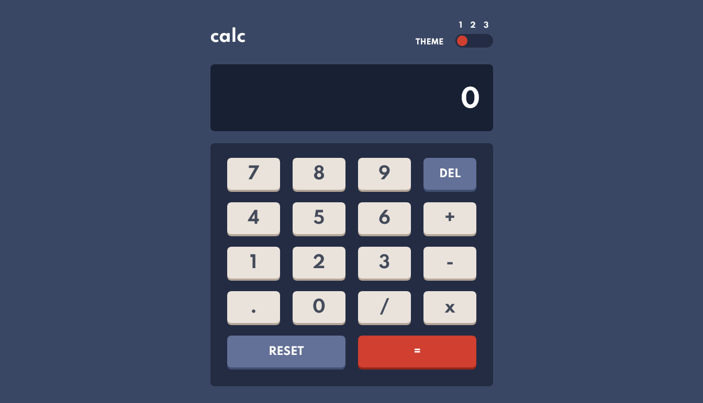

# Frontend Mentor - [Calculator app](https://www.frontendmentor.io/challenges/calculator-app-9lteq5N29)

### <u>**_Screenshot_**</u>

### Links

- [Github](https://github.com/Dinesh1042/Frontend-Mentor-Challenges/tree/main/Calculator)
- [Calculator live site](https://calculator-one-kappa.vercel.app/)

## My process

### Built with

- Semantic HTML5 markup
- CSS custom properties
- Flexbox
- CSS Grid
- Mobile-first workflow
- Typescript

* Scss

- **No Framework Used**

## Author

- Website - [Calculator App](https://calculator-one-kappa.vercel.app/)
- Frontend Mentor - [Dinesh1042](https://www.frontendmentor.io/profile/Dinesh1042)
