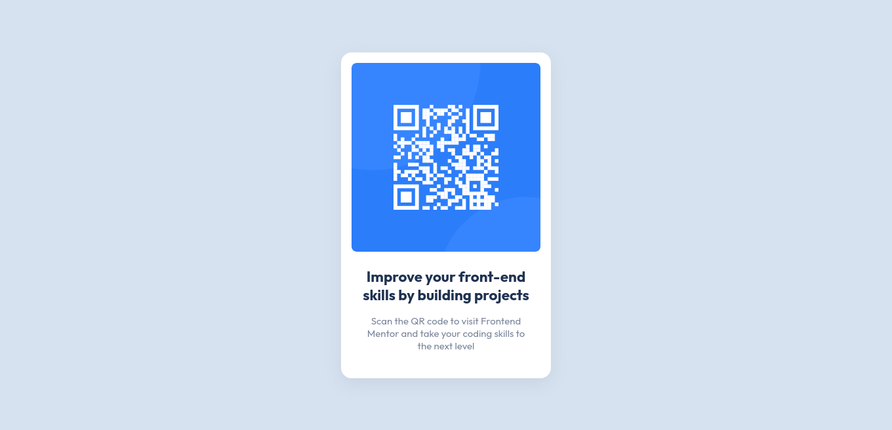

# QR code component solution

## Table of contents

- [Overview](#overview)
  - [Screenshot](#screenshot)
  - [Links](#links)
- [My process](#my-process)
  - [Built with](#built-with)
  - [What I learned](#what-i-learned)
  - [Useful resources](#useful-resources)

## Overview

### Screenshot

### Links

- Solution URL: [View Code](https://your-solution-url.com)
- Live Site URL: [View Site](https://your-live-site-url.com)

### Built with

- Semantic HTML5 markup
- CSS custom properties
- Flexbox
- CSS Grid
- Mobile-first workflow

### Useful resources

- [CSS Box-shadow](https://getcssscan.com/css-box-shadow-examples) - An Amazing site for getting ton of different box-shadow.

## Author

- Frontend Mentor - [@Dinesh1042](https://www.frontendmentor.io/profile/Dinesh1042)
