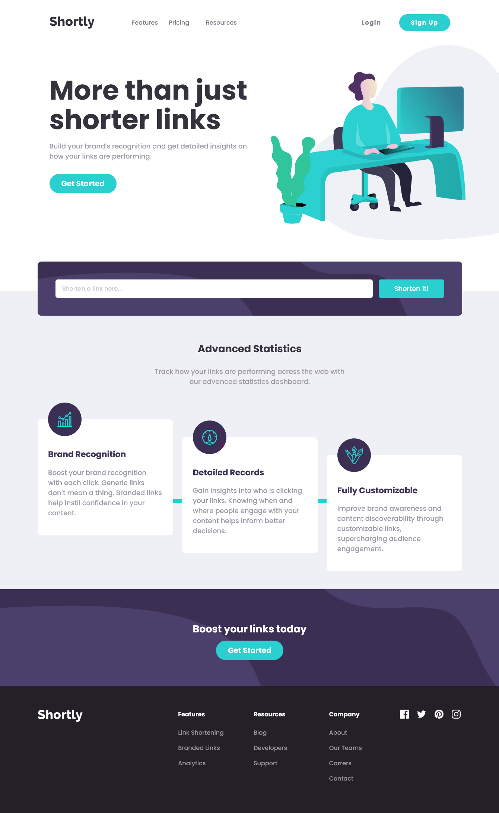

# Frontend Mentor - Shortly URL shortening API Challenge solution

This is a solution to the [Shortly URL shortening API Challenge challenge on Frontend Mentor](https://www.frontendmentor.io/challenges/url-shortening-api-landing-page-2ce3ob-G)

### Screenshot

### Links

- Github: [Add solution URL here](https://github.com/Dinesh1042/Frontend-Mentor-Challenges/tree/main/Url%20Shortening)
- Live Site URL: [Add live site URL here](https://your-live-site-url.com)

## My process

### Built with

- Semantic HTML5 markup
- CSS custom properties
- Flexbox
- CSS Grid
- Mobile-first workflow
- Vannila javascript project
- **Not used Any FrameWorks!**

### What I learned

While making this projects. hero section was preety much hard form aligning the hero hero of the hero section. i have used grid and flex box in this project.
I have learned bit more about grid and flexbox.

## Author

- Website - [Url Shortening](https://www.your-site.com)
- Frontend Mentor - [Dinesh1042](https://www.frontendmentor.io/profile/yourusername)
