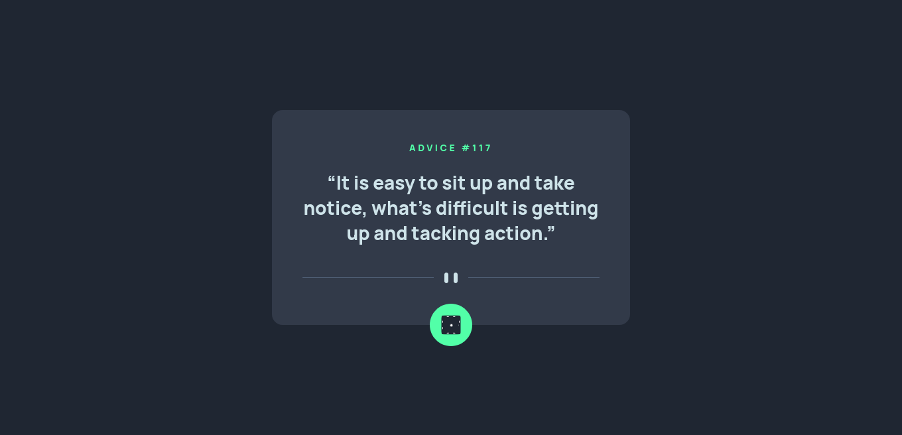

# Frontend Mentor - [Advice Generator](https://www.frontendmentor.io/challenges/advice-generator-app-QdUG-13db)

## Table of contents

- [Overview](#overview)
  - [The challenge](#the-challenge)
  - [Screenshot](#screenshot)
  - [Links](#links)
- [My process](#my-process)
  - [Built with](#built-with)
  - [What I learned](#what-i-learned)
  - [Useful resources](#useful-resources)
- [Author](#author)

## Overview

### The challenge

Users should be able to:

- View the optimal layout for the app depending on their device's screen size
- See hover states for all interactive elements on the page
- Generate a new piece of advice by clicking the dice icon

### Screenshot

### Links

- [Advice Generator Github](https://your-solution-url.com)
- [Advice Generator live](https://your-live-site-url.com)

## My process

### Built with

- Semantic HTML5 markup
- CSS custom properties
- Flexbox
- CSS Grid
- Sass
- Mobile-first workflow
- [React](https://reactjs.org/) - JS library

### What I learned

In this project i have learned how to create a 3d dice roll the dice on clicks

### Useful resources

- [3d Dice](https://codepen.io/SteveJRobertson/pen/zxEwrK) - This helped me for how to create 3d Dice. I really liked this pattern and will use it going forward.

## Author

- Frontend Mentor - [@Dinesh1042](https://www.frontendmentor.io/profile/Dinesh1042)
